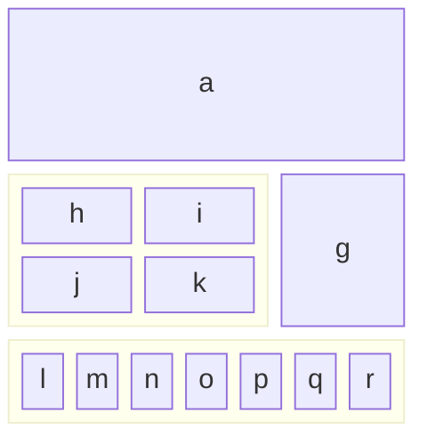

# Kotlin Research

> Project for research on functional programming through the Kotlin language ecosystem.

![Badge-CI]

## Commands

- ```./gradlew clean test jacocoTestReport```
- ```./gradlew test --tests ValidationModuleTest```

## Links
- https://kotlinlang.org/docs/home.html
- https://arrow-kt.io/

[Badge-CI]: https://github.com/butcherless/kotlin-research/actions/workflows/kotlin-ci.yml/badge.svg


